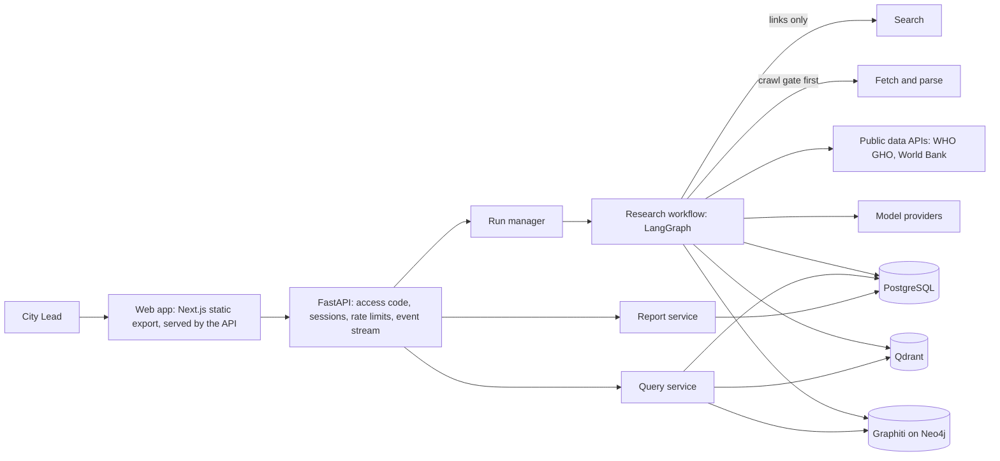
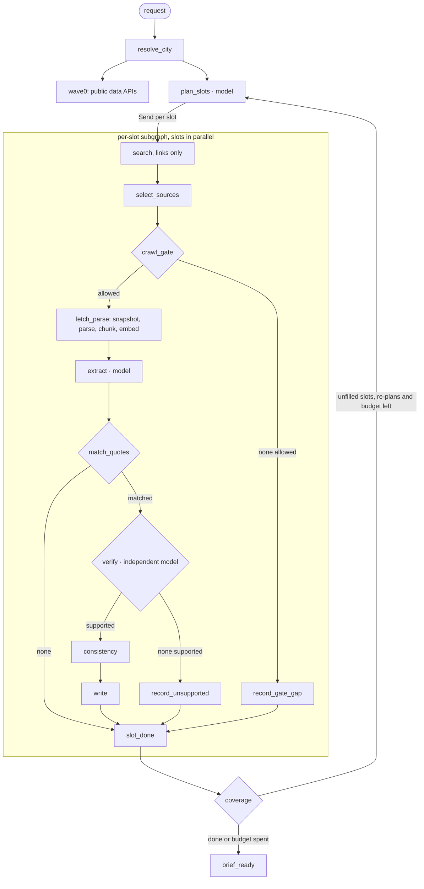
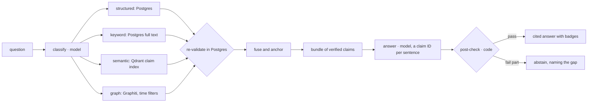

# Architecture overview

CARDIO4Cities City Intelligence takes a city name, researches the public web at request time, verifies what it finds, and gives a City Lead a cited brief of the city's cardiovascular landscape: burden figures, programmes, policies, stakeholders, data, and an explicit record of what could not be found. It answers follow-up questions from verified evidence only and produces a downloadable report.

**The design stance in one line:** precision over coverage. A wrong or misattributed fact is a failure; an honest "not found" is a correct answer.

**The architectural stance:** the agent is the system, not the model. Models are used in six narrow roles where code reaches its limits; code owns orchestration, permissions, evidence, verification consequences, persistence and audit.

This document is the summary. The detail is in `docs/design/` (requirements, HLD, LLD-1 to LLD-5) and the reasons in `docs/DECISIONS.md` (BD-01 to BD-52).

---

## 1. At a glance

| | |
|---|---|
| Input | A city name, confirmed against the GeoNames gazetteer before research starts |
| Unit of work | 16 fixed research questions ("slots") in 6 dimensions: Governance, Burden, Programmes, Policy, Stakeholders, Data |
| Workflow | LangGraph: a run-level graph plus a per-slot subgraph fanned out in parallel |
| Models | Six roles: planner, extractor, checker, question classifier, answerer, report writer |
| Stores | PostgreSQL (proves), Qdrant (finds), Graphiti on Neo4j (connects) |
| Bounds per run | 420 s, 64 searches, 120 fetches, 3M tokens, $3 |
| Measured cost | About $1.10 to $1.60 and 5 to 7 minutes per run on the deployed models |
| Outputs | Live brief with coverage grid, evidence drawer for every fact, cited Q&A, report (Markdown, HTML, PDF) |

---

## 2. Major components



| Component | Responsibility |
|---|---|
| Web app | Search and confirm a city, watch research live, read the brief, open the evidence for any fact, ask questions, download the report. Plain vocabulary: Confirmed, Reported not confirmed, Analysis, Not found, Sources disagree |
| API | Access and admin codes, signed sessions, per-IP rate limits, events written to Postgres before they are streamed (a page can replay after a disconnect) |
| Research workflow | The LangGraph graph in §3: plans, searches, gates, fetches, extracts, verifies, writes, decides coverage |
| Query service | Classifies a question, retrieves from four routes, re-validates in Postgres, answers, post-checks (§5) |
| Report service | Assembles the report from stored facts by code; a model writes only linking prose, which is post-checked |
| Ports and adapters | Every external system sits behind a port: LLM, search, fetch, parse, embeddings, vector, graph, snapshots, renderer, public data. Vendor SDKs live only in `app/adapters/`; an import-lint test enforces it. Each model role is bound in config, so a provider is swapped without code changes |

---

## 3. AI and agent architecture

### 3.1 Where models are used, and where they are not

| Stage | Owner | In this system |
|---|---|---|
| Goal | Code | The confirmed city plus 16 fixed slots |
| Context assembly | Code | Slot definitions for planning; the claim and its code-located passage for checking; verified claims for answering |
| Reasoning | **Model** | Plan queries; extract claims; check claims; classify a question; write an answer; write report linking prose |
| Parsing | Code | Schema validation; labels never inferred; quotes found verbatim; numbers parsed by code |
| Guardrails | Code | Crawl gate, independent check, consistency, budget guard, answer post-check |
| Tools | Code | Links-only search, gated fetch, data APIs, store writes |
| Loop and stop | Code | Unfilled slots re-planned at most twice; the budget always ends the run |
| Output | Code | Brief, answers and report assembled from stored, checked facts |

How much control a model gets depends on two things: how cheaply its output can be verified, and what an undetected mistake costs. Extraction is delegated because code can check that a quote is in the page. Sufficiency, permissions and stopping stay in code because they are hard to verify and costly to get wrong.

| Role | Deployed model | Prompt |
|---|---|---|
| Planner | Claude Sonnet 5.5 | planner v5 |
| Extractor | Claude Haiku 4.5, one escalation to Sonnet 5.5 on invalid output | extractor v6 |
| Checker | OpenAI gpt-6.1-sol (low effort); Claude Opus 5.5 as a labelled fallback | checker v4 |
| Question classifier | Claude Haiku 4.5 | classifier v2 |
| Answerer | Claude Sonnet 5.5 | answerer v2 |
| Report writer | Claude Sonnet 5.5 | reporter v1 |

The checker comes from a different model family than the extractor, and sees only the claim, its labels and the passage located by code: never the extractor's prompt or output reasoning.

### 3.2 The research workflow



| Node | Kind | What it decides |
|---|---|---|
| `resolve_city` | Code | The canonical place: gazetteer ID, country, region, alternate names |
| `wave0` | Code | National figures from public data APIs, keyed by country code; verified by code against the stored record |
| `plan_slots` | Model | Two queries per slot, local sources first; on re-plan, only unfilled slots, told what was tried and which sites refused access |
| `select_sources` | Code | Dedupe, publisher tier, hits naming the city first, pages about other places later, at most 2 pages per domain |
| `crawl_gate` | Code agent | Before any content request: robots.txt (RFC 9309), AI-use opt-outs, login or paywall, private addresses, rate limits. Every decision is stored and streamed |
| `fetch_parse` | Code | Snapshot bytes with a hash; parse HTML and PDF (tables kept whole, two-column pages by column); chunk and embed |
| `extract` | Model | Claims with labels and a verbatim quote; pages naming the city read first |
| `match_quotes` | Code | Exact quote match after normalisation; value parsing; geography fit against the gazetteer; drops with a recorded reason |
| `verify` | Model | Supported, refuted or insufficient, for the top 5 claims per slot per round, city-level first |
| `consistency` | Code | Agrees, novel, conflicts or not comparable, against earlier claims for the same indicator |
| `write` | Code | Facts to Postgres, the claim index to Qdrant, relation claims as graph edges, supersession |
| `coverage` | Code | One status per slot and a gap note; loops to planning or stops |

**Where the agency is:** five decisions with consequences, all in the trace: the planner re-plans gaps, the selector chooses pages, the gate blocks, the checker rejects, coverage loops or stops.

**Bounds and termination:** every external call reserves budget first. At 85% of the wall clock the run winds down: no new searches or fetches, work in hand finishes, and every slot still gets a status. A failed step costs one item, never the run; it is recorded and named in the report when it could have hidden a finding.

---

## 4. Data architecture

### 4.1 What each store owns

| Store | Role | Owns | Never holds | Read by |
|---|---|---|---|---|
| **PostgreSQL** | Proves | Runs and events, sources and snapshots, crawl decisions, claims, statistics, relations, verdicts, consistency, contested pairs, entities and aliases, graph links, slot results, answers, reports, reference data, workflow checkpoints | Embeddings; graph structure | Brief, findings, evidence drawer, report, structured and keyword retrieval, re-validation |
| **Qdrant** | Finds | `claim_index` (confirmed claims, for meaning-based retrieval) and `source_chunks` (all fetched text, for "mentioned, not confirmed"), filtered by city | Verdicts; anything shown as a fact | Semantic retrieval |
| **Graphiti on Neo4j** | Connects | Verified entities and dated relationships, one partition per city; every edge carries its claim IDs | Statistic values; unverified claims | Relationship and "as of" questions, entity exploration |

Postgres has the final word: every candidate from Qdrant or the graph is re-checked against it before use, so a stale index can never surface a refuted or superseded claim. Collection names include the embedding model's key, so embeddings from different models are never mixed.

### 4.2 The evidence contract

Every fact the user sees resolves, by foreign keys, through one chain:

```text
answer sentence / report line / brief item
  → claim       statement, verbatim quote, character offsets, labels, status
  → verdict     label, rationale, checker model and family, prompt version
  → source      URL, publisher class, published and retrieved dates
  → snapshot    the bytes as fetched, with SHA-256 hash
```

A claim carries its scope labels: geography level and fit, population (ages, sex, group), setting, measure type, method, representativeness, reference period, denominator. Labels are filled only when the source states them; otherwise they stay empty and are flagged. Models never produce numbers: they copy the value as written, and code parses it and checks it appears inside the quote.

### 4.3 The graph and time

- **Entities:** Place, Organization, Person, Programme (with status), Policy, Indicator.
- **Relations:** GOVERNS, REPLACED_BY, PART_OF, RUNS, FUNDS, PARTNERS_WITH, OPERATES_IN, ISSUED_BY, APPLIES_TO, LEADS, MEASURED_IN (which links an indicator to a place and carries no value). Other pairs are refused.
- **Only supported relation claims become edges.** Entity IDs come from our resolver (normalised names, acronyms found in the sources); similar names are logged for review, never merged automatically.
- **Writes bypass Graphiti's LLM ingestion** (spike S-1): nodes and edges are saved through Graphiti's model classes with our IDs and embeddings; reads use Graphiti's hybrid search and temporal filters.
- **Three dates on every claim:** when it was true, when it was published, when it was retrieved. Edges carry `valid_at` and `invalid_at`; a newer supported claim for who governs or leads end-dates the old edge and marks the old claim superseded. Nothing is deleted.

---

## 5. Retrieval strategy

Question answering retrieves **facts, not text**, never searches the web and never writes facts.



1. **Understand:** the classifier returns question type, slots, indicators, entities, an as-of date and up to three sub-questions. A follow-up reuses the previous turn's classification, never its answer text.
2. **Find:** four routes run in parallel.
3. **Re-validate:** every candidate is re-checked in Postgres for city, latest run, status and time scope.
4. **Fuse and anchor:** reciprocal rank fusion; then each asked slot's best verified claim, or its gap record, is always included, whatever the search found.
5. **Bundle:** at most 8 facts; both sides of a disagreement kept together; unconfirmed text only as "mentioned, not confirmed".
6. **Answer:** one claim ID per sentence.
7. **Post-check (code):** every citation exists and is in the bundle; numbers, places, names and years come from the evidence; both sides of a contested pair cited; wider-area figures carry their note. Failing parts become abstentions.
8. **Store:** the answer with its full retrieval trace.

---

## 6. Trust mechanics

| Layer | Mechanism | Stops |
|---|---|---|
| Permission | Crawl gate before every fetch; search used for links only | Unauthorised extraction |
| Authenticity | Snapshot with hash | "The page changed" disputes |
| Grounding | Exact quote match after normalisation; value inside the quote | Invented or altered quotes and numbers |
| Verification | Independent checker on a restricted input | Claims the passage does not support |
| Consistency | Compare only compatible figures; contested pairs | Silent overwrites; false contradictions |
| Scope | Required labels; gazetteer geography; own-indicator rule | National or related figures shown as the city's answer |
| Presentation | One main badge per fact: Not city-level > Sources disagree > Outdated > Limited sample; deterministic High, Medium or Low confidence | Missed caveats |
| Answering | Verified-only bundle; post-check; abstention | Fabricated or overreaching answers |
| Safety | Fetched text wrapped and escaped as data, never logged; models have no tools | Prompt injection |

**Statuses are explicit at three levels.** Claims: supported, refuted, insufficient, contested, superseded (refuted and insufficient are never facts). Slots: answered, answered with wider-area evidence only, not found, blocked, unreachable; each with a gap note written by code. Facts: a badge and a confidence label computed at read time.

---

## 7. Key trade-offs and design decisions

| Decision | Alternative rejected | Why |
|---|---|---|
| Fixed catalogue of 16 slots | Open-ended agent research | Comparable, bounded coverage; gaps become measurable; "done" is decidable by code |
| Workflow with bounded loops; agency in five traced decisions | Autonomous tool-using agent | Bounded cost and time; testable; auditable |
| Crawl gate in code, before any fetch | A model judging permission | Deterministic, explainable decisions with enforceable consequences |
| Checker from another model family, restricted input | The producer checks its own work | Reduces shared blind spots; independence is tested |
| Exact quote matching after normalisation | Fuzzy matching | Fuzzy matching admits paraphrase; parsing is fixed instead (BD-47) |
| Models copy values; code parses numbers | Model-written numbers | Numbers can't be invented or misread silently |
| Statistic values stay in Postgres | Values on graph edges | Graph supersession must never overwrite a statistic; values need their metadata |
| Graph written directly through Graphiti's model classes | Graphiti's LLM ingestion | Keeps claim IDs; no model call per write (BD-11) |
| Report assembled by code; model writes linking prose only | Model-written report | No new fact can enter the report |
| "Prevalence, method not stated" in the vocabulary | Forcing measured, self-reported or modelled | Forcing a choice made the model infer, and the checker rightly rejected it (BD-48) |
| Local-first planning and selection | A per-country list of sources | A source list is country data in the repository; ranking by city naming is generic (BD-50) |
| Groups and areas "in" the city kept as part of the city | Dropping labels the gazetteer can't place | Local studies are often the only city evidence; they are badged, never counted as city-wide (BD-51) |
| A figure never answers a question that asks for no figure | Accepting any supported fact | Keeps coverage honest (BD-52) |
| No human review before storage | Review every fact | Live research on demand; status and evidence shown instead; review queue for contested pairs and named people in production |
| English-only queries in the PoC | Local-language queries | Scope and cost; a known limit for non-English cities (BD-31) |

**Measured, not assumed.** Retrieval was found to be the limit, not checking: in one run on a large English-speaking city, only 6 of 48 pages read were about the city. Local-first planning and selection, and geography rules that keep local evidence, raised pages about the city to 22 of 61 and confirmed city or part-of-city facts from 6 to 18. On a large Indian city, the same generic rules raised them from 2 to 21, at a similar cost and time. Component quality is measured on golden sets for a fictional city: extractor 43 of 48 expected claims, checker 28 of 28 expected verdicts, retrieval recall 26 of 26 gold claims.

---

## 8. Answers to the brief's open design questions

| Question | Answer |
|---|---|
| What does "understanding a city" consist of, and in what depth? | Six dimensions, 16 slots, with the hypertension control rate as the headline. Depth: enough for a first meeting, meaning a few verified, scoped facts per area and an honest record of the gaps |
| How should research be planned? | Identity first; national figures from public data APIs by code; a planner writes two queries per slot, local sources first; code re-plans only unfilled slots, at most twice, within the budget |
| How should sources be evaluated? | Before reading: permission, publisher tier, whether the page is about the city. After reading: exact quote, independent check, then a confidence label from tier, sampling, geography fit, recency and denominator, with reasons shown |
| Should humans review information before it is stored? | No: automated gates replace pre-storage review, and every fact shows its status and evidence. Contested pairs and single-source leaders are flagged for a person; a review queue is the production step |
| How do you know when research is sufficient, and what happens when it isn't? | Per slot, by code: answered when a confirmed fact exists at an accepted level for the slot's own indicator. Otherwise re-plan within budget; at the end every slot has a status and a note of what was tried |
| How should conflicting information be handled? | Compare only compatible figures (indicator, threshold, measure, age band, sex). Real disagreements are marked contested and both sides are always shown together |
| How should institutional memory be represented over time? | Three dates on every claim; dated graph edges; supersede by end-dating, never delete; every run kept with its date |
| How should relationships be modelled? | A typed graph of six entity types and eleven relations with allowed pairs, built only from verified claims, each edge carrying its claim IDs and dates |
| What information belongs in which datastore? | Postgres proves, Qdrant finds, Graphiti connects; Postgres re-validates every candidate from the other two |
| How should conversational retrieval work? | Classify, retrieve from four routes, re-validate, anchor each asked slot, answer with a citation per sentence, post-check in code, abstain where unsupported, store the trace |
| How should the system distinguish facts from assumptions? | Explicit kinds: Confirmed, Reported not confirmed, Analysis, Not found, Sources disagree. Labels are never inferred, numbers are never model-generated, and analysis is never stored as a fact |
| How should missing information be represented? | As a first-class result: not found, blocked and unreachable are distinct statuses, each with a code-written note; the report lists them and answers abstain by naming them |

---

## 9. Known limits and next steps

| Limit | Next step |
|---|---|
| City-level figures often sit in spreadsheets and data files linked from pages | Read CSV and Excel files linked from fetched pages, through the same gate and quote rule |
| Districts missing from the gazetteer are dropped; a "City of X" authority can be read as the city | Load administrative areas from per-country GeoNames files |
| Search queries vary between runs | Seed round 1 with one template query per slot |
| English-only search | Local-language queries for non-English cities |
| Official sites that block automated access or don't respond | Recorded as blocked or unreachable, never bypassed; look for documents that re-quote their figures |
| No human review queue | Review queue for contested pairs and named people, with feedback into the golden sets |

---

## 10. Where to read more

| Topic | Document |
|---|---|
| Requirements and acceptance tests | `docs/design/REQUIREMENTS.md` |
| Components, workflow, data, trust | `docs/design/HLD.md` |
| Types, schema, Qdrant, Graphiti | `docs/design/LLD-1-data.md` |
| Workflow nodes and algorithms | `docs/design/LLD-2-workflow.md` |
| Model roles and prompts | `docs/design/LLD-3-prompts.md` |
| API, events, config, errors | `docs/design/LLD-4-interfaces.md` |
| Question answering | `docs/design/LLD-5-retrieval.md` |
| Every decision, with measurements and rejected alternatives | `docs/DECISIONS.md` |
| Deployment and operations | `docs/DEPLOYMENT.md` |
