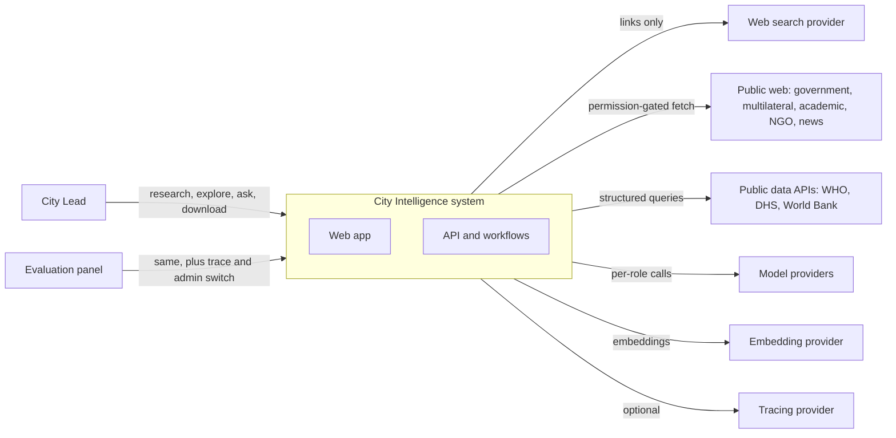
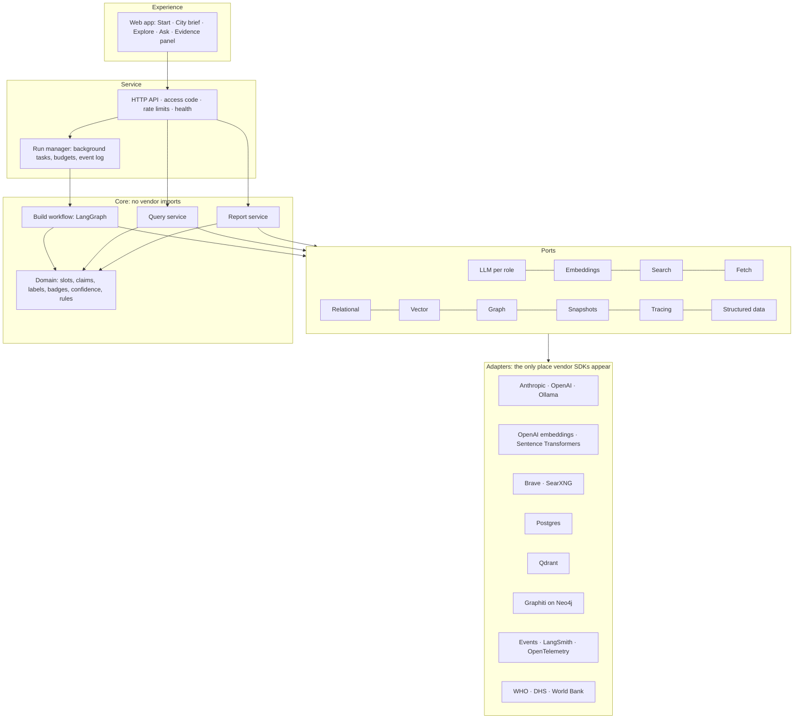
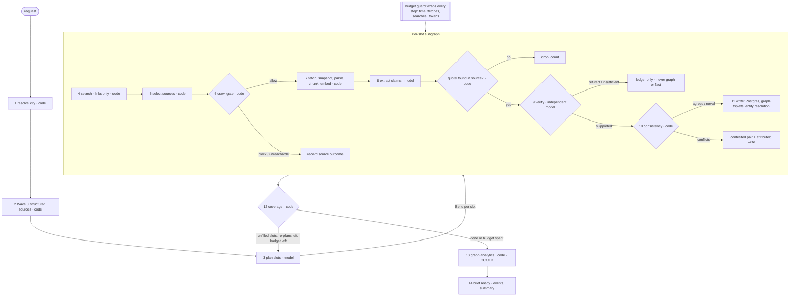
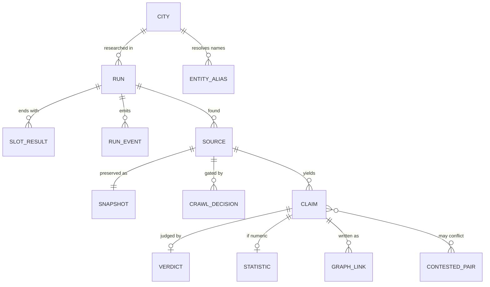
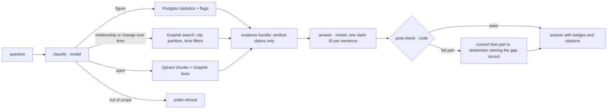
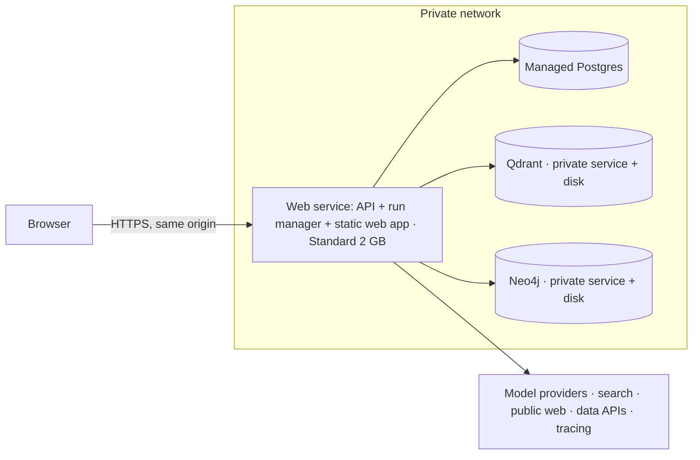

# CARDIO4Cities City Intelligence: High-Level Design

| | |
|---|---|
| **Version** | 1.0 |
| **Date** | 2026-10-02 |
| **Status** | Baseline for the LLD and build |
| **Inputs** | `docs/design/REQUIREMENTS.md` v1.1 · `docs/design/BRAINSTORM.md` v1.0 · prior design export (reused, with changes Δ1–Δ14) |
| **Feeds** | `docs/design/LLD.md` · `docs/design/REPO_STRUCTURE.md` · `docs/design/BUILD_PLAN.md` · `docs/ARCHITECTURE.md` (concise version for the panel) |

**Scope of this document.** Components, responsibilities, the research workflow, the question-answering path, data ownership, trust mechanics, interfaces, deployment and cross-cutting concerns. Exact table schemas, node input/output contracts, prompts and API payloads belong in the LLD.

**For Claude Code.** Implement what this document describes. Where it is silent, follow `REQUIREMENTS.md`; where they conflict, `REQUIREMENTS.md` wins. Section 16 lists the design decisions to record in `docs/DECISIONS.md`.

---

## 1. Architectural drivers

The design is shaped by a small number of forces. Every major choice below traces to one of them.

| # | Driver | Source |
|---|---|---|
| AD-1 | **Precision over coverage.** A wrong or misattributed fact is a failure; an honest gap is a correct output | R-08, §1.4 of requirements |
| AD-2 | **Sparse data is normal.** Most target cities have only national or district figures | Analysis probes |
| AD-3 | **Cold start, live, on a city the panel names**, with nothing city-specific preloaded | R-01, R-83, DS-1 |
| AD-4 | **Evidence must survive scrutiny**: any fact traces to an exact passage in a preserved source | R-07, R-55, R-56 |
| AD-5 | **Independent verification with consequences** | R-04, R-38 |
| AD-6 | **The graph must be genuinely used**, and three stores must each earn their place | R-05, R-06 |
| AD-7 | **A live demo must not fail**: bounded runs, survivable connections, no sleeping services | R-09, R-61, R-77, R-80 |
| AD-8 | **No vendor lock-in**: every provider switchable in configuration | R-81, CON-11 |
| AD-9 | **Timebox**: about 32–44 build hours; a working end-to-end slice beats breadth | CON-01 |

## 2. Design principles

1. **The slot is the unit of work.** Planning, parallelism, sufficiency, the coverage grid, report sections and gap records all use the same fixed slot catalogue (requirements §3.1).
2. **Build path writes, query path reads.** Only the research workflow creates facts. Question answering never researches and never writes facts.
3. **Code decides what code can check.** Permission, quote location, geography tags, conflict ordering, confidence, sufficiency and answer checking are deterministic. Models are used for judgment: planning, extraction, entailment, writing.
4. **Every model output is validated** against a schema before it can affect stored data.
5. **One owner per datum.** Each piece of data has exactly one owning store; other stores refer to it by ID.
6. **Missing information is data.** Gaps are stored with reasons and what was tried.
7. **Ports and adapters.** The core depends on interfaces; providers are adapters selected in configuration.
8. **Fail visible, not silent.** Blocked, unreachable, unreadable, insufficient and contested are first-class states shown to the user.

### 2.1 The agentic pattern, applied

This system follows the pattern in [Sketching Agentic AI: A Coffee Table Discussion](https://medium.com/@rachanna/sketching-agentic-ai-a-coffee-table-discussion-ef467ba66774): the model is placed only where deterministic software reaches its limits, and code owns context, orchestration, guardrails, tools, observation and memory. **The agent is the system, not the model.**

| Stage | Owner | In this system |
|---|---|---|
| Goal | Code | A city confirmed against the gazetteer, plus 16 fixed slots |
| Context assembly | Code | Identity and slot definitions for planning; claim plus code-located passage for checking; verified claims for answering |
| Memory | Code | Postgres proves, Qdrant finds, Graphiti connects, snapshots preserve |
| Reasoning | **Model** | Six roles only: plan queries, extract claims, check claims, classify question, write answer, report prose |
| Parser | Code | Schema validation; required labels never inferred; quote found verbatim |
| Guardrails | Code | Crawl gate, independent check, consistency, budget guard, answer post-check; rejects become recorded gaps |
| Tool execution | Code | Links-only search, gated fetch, data APIs, store writes, all through adapters |
| Observation | Code | Crawl outcomes, verdicts, slot statuses, stored events |
| Loop | Code | Unfilled slots re-planned at most twice; the budget always ends the run |
| Output | Code | Brief, cited answers and report assembled from stored, checked facts |

**How much control the model gets** is set by two questions: how cheaply its output can be verified, and what an undetected mistake costs. Extraction is delegated because a quote either is or is not in the source; sufficiency stays in code because it is hard to verify and errors are expensive here.

---

## 3. System context



The system has no inbound integrations and no user accounts. All external access is outbound and goes through adapters.

---

## 4. Component architecture

### 4.1 Layers



### 4.2 Components and responsibilities

| Component | Responsibility | Requirements |
|---|---|---|
| **Web app** | Four screens plus evidence panel; consumes the event stream; plain vocabulary | R-14, R-29–R-31, R-78, R-90 |
| **HTTP API** | Endpoints (§11); access code; rate limits; `/health` | R-09, R-50, R-77 |
| **Run manager** | Starts runs as background tasks; enforces one run at a time and run budgets; writes progress events; supports replay | R-49, R-61, R-80 |
| **Build workflow** | The research workflow (§5) | R-01–R-08, R-10–R-13 |
| **Query service** | Question answering (§7) | R-15, R-63, R-64 |
| **Report service** | Report assembly and rendering (§8) | R-17, R-32 |
| **Domain** | Slot catalogue, claim and label model, badge and confidence rules, conflict rules, vocabulary mapping | R-33–R-35, R-47, R-48, R-78, R-79 |
| **Ports** | Interfaces for every external dependency | R-81 |
| **Adapters** | Provider implementations; contract-tested | R-81, AT-34, AT-35 |
| **Config loader** | Loads environment config; validates it at start-up | R-82, AT-36 |

---

## 5. Build path: the research workflow

### 5.1 Overview

The workflow is a LangGraph graph with a **run-level stage** (identity, Wave 0, planning, sufficiency, analysis) and a **per-slot subgraph** fanned out in parallel with LangGraph's Send primitive. A fetch cache keyed by URL ensures a page used by several slots is fetched, gated and parsed once.



### 5.2 Nodes

| # | Node | Kind | Responsibility | Key rule |
|---|---|---|---|---|
| 1 | Resolve city | Code | Turn the user's text into a canonical place (gazetteer ID, country, admin hierarchy, population, languages). Ambiguous names are resolved **before** the run starts via an API call the UI shows as a choice | R-57, T-10, T-16 |
| 2 | Wave 0 | Code | Query the generic country-keyed registry of public data APIs; produce structured claims (always `national` or `sub_national`) | R-85, DEC-13 |
| 3 | Plan slots | Model (Sonnet 5.5) | For each slot: 2–3 queries in English and the local language. On re-plan, only unfilled slots, using gap notes. Prompt contains identity and slot definitions, never city facts | R-01, DQ-02 |
| 4 | Search | Code via search port | Links-only queries; rate-limited queue | R-58, AT-33 |
| 5 | Select sources | Code | Deduplicate; tier by publisher class; prefer official APIs when a site offers one; cap candidates per slot | R-41, R-59 |
| 6 | Crawl gate | Code (deterministic agent) | RFC 9309 plus `Content-Usage`; login and paywall detection; crawl-delay and `Retry-After`; private-address blocking; logs decision and reason | R-03, R-40, R-67, R-86 |
| 7 | Fetch and parse | Code | Fetch through the fetch port; store snapshot with hash; parse HTML and PDF (tables kept whole with headers); chunk and embed all text into Qdrant; mark `unreadable` when parsing fails | R-11, R-39, R-55 |
| 8 | Extract | Model (Haiku 4.5, escalate to Sonnet 5.5) | Produce claims with required labels and a verbatim quote; never infer labels the source doesn't state; code then locates the quote after normalisation | R-33, R-56, R-89 |
| 9 | Verify | Model (OpenAI checker; labelled Opus 5.5 fallback) | Judge claim against the code-located passage only: supported, refuted or insufficient, with rationale; at most about 5 claims per slot, ranked by tier and geography fit | R-04, R-38, R-47 |
| 10 | Consistency | Code | Compare a supported claim with prior claims for the same indicator or relationship using metadata; outcome agrees, novel, conflicts or not comparable | R-35, R-65, Δ11 |
| 11 | Write | Code | Postgres claim, verdict, statistic; entity resolution; Graphiti triplets for supported relationship claims; provenance links | R-43, R-45, R-87, Δ1 |
| 12 | Coverage | Code | Assign each slot its status and reason flags; loop to planning for unfilled slots if re-plans and budget remain | R-79, DQ-05 |
| 13 | Graph analytics | Code | Centrality of stakeholders in the city subgraph, computed in the app | R-70 (COULD), Δ3 |
| 14 | Brief ready | Code | Final events; run summary | R-84 |

**Structured-source claims (Wave 0) are verified by code, not by the model checker.** They are produced deterministically from a stored API record, so verification is a deterministic match between the claim and the snapshotted record (value, indicator, area, period). The independent model checker exists to verify information produced by a model (R-04). This is recorded as design decision HD-03.

### 5.3 Shared state

The state carries **references, not page text**, so checkpoints stay small. Payloads live in the stores.

| Field | Holds |
|---|---|
| `run_id`, `city` | Run identity and canonical place |
| `slots` | Slot catalogue entries with per-slot status, queries tried, sources checked, re-plan count |
| `sources` | Source IDs with tier, crawl outcome and parse outcome |
| `claims`, `verdicts` | Claim IDs and verdicts |
| `consistency` | Outcomes and contested pairs |
| `entities` | Mention-to-canonical-entity map for this run |
| `budget` | Counters: elapsed time, fetches, searches, tokens, model cost |
| `versions` | Model IDs and prompt versions in use |

The verifier receives a **restricted slice**: one claim, its labels and the code-located passage. It never sees the extractor's prompt, output reasoning or other claims (AT-07).

### 5.4 Loops, budgets and termination

| Control | Default | Effect when reached |
|---|---|---|
| Re-plans per slot | 2 | Slot ends `answered_negative` (or `blocked` / `unreachable`) with queries listed |
| Claims verified per slot | about 5 | Remaining claims stay in Qdrant as "found, not verified" |
| Fetches per run | about 60 | No new fetches; current work finishes |
| Searches per run | about 48 | No new searches |
| Wall clock per run | about 5 min | Stop new work; finish writes; mark coverage |
| Tokens / model cost per run | set after day-1 measurement | As above |

A run **always** ends with every slot carrying a status (AT-32). The budget guard is a wrapper checked before every external call, not a separate step.

### 5.5 Agents and model bindings

| Agent | Kind | Default binding | Why |
|---|---|---|---|
| Planner | Model | Claude Sonnet 5.5 | Query quality compounds across the run |
| Extractor | Model | Claude Haiku 4.5, escalating one document to Sonnet 5.5 on validation failure or complex tables | High volume; escalation keeps quality on hard PDFs |
| Checker | Model | OpenAI frontier model `[ID day 1]`; fallback Claude Opus 5.5, labelled `same_family_fallback` | Different family reduces own-family bias |
| Answerer | Model | Claude Sonnet 5.5 | Grounded synthesis at interactive speed |
| Report writer | Model | Claude Sonnet 5.5 | Linking prose only |
| Question classifier | Model | Claude Haiku 4.5 | Cheap, narrow |
| Crawl gate | Code agent | n/a | Auditable permission decisions |
| Coverage assessor | Code agent | n/a | Deterministic sufficiency |

**Agency** is located in five decisions with consequences: the planner re-plans gaps, the source selector chooses what to fetch, the gate blocks, the checker rejects, the coverage assessor loops or stops. All five appear in the trace.

---

## 6. Data architecture

### 6.1 Store ownership

| Store | Role | Owns | Never holds |
|---|---|---|---|
| **PostgreSQL** | **Proves** | Cities, runs, slot results, sources, crawl decisions, claims, verdicts, statistics with full metadata, contested pairs, entity aliases, graph links, run events, run summaries, reference data (gazetteer, source registry, slot catalogue, indicator definitions), workflow checkpoints | Embeddings; graph structure |
| **Qdrant** | **Finds** | Embedded chunks of all fetched text, including text that never became a verified fact; filtered by city | Verdicts; anything presented as fact |
| **Graphiti on Neo4j** | **Connects** | Verified entities and time-bounded relationships, one partition (`group_id`) per city; every edge carries claim IDs | Statistic values (R-87); unverified claims |
| **Snapshots** (table in Postgres) | **Preserves** | Raw fetched bytes, compressed, with content hash, retrieval time and size cap | Parsed text (that lives with the source and in Qdrant) |

Graphiti searches **facts**; Qdrant searches **raw text**. That separation is what makes each store load-bearing.

### 6.2 Conceptual model



The unit of truth is the **claim**: one statement from one source with a verbatim quote, its labels (required and optional), its slot and its status. Statistics are claims with a numeric value and the full metric metadata (R-33).

### 6.3 Provenance spine

Every fact the user sees resolves by ID joins:

```
answer sentence / report line / explorer item
  → claim (statement, quote, character offsets, labels)
  → verdict (label, rationale, checker model, prompt version)
  → source (URL, publisher class, published date, retrieved date)
  → snapshot (bytes, hash)
```

Graph edges reach claims through `graph_link`; Qdrant hits carry `source_id` and character offsets. Foreign keys make the chain unbreakable; code-located quotes make invented quotes impossible to store.

### 6.4 Graph ontology

| Entity types | Place · Organization (subtype for facilities) · Person · Programme · Policy · Indicator |
|---|---|
| **Relationships** | GOVERNS · REPLACED_BY · PART_OF · RUNS · FUNDS · PARTNERS_WITH · OPERATES_IN · ISSUED_BY · APPLIES_TO · LEADS · MEASURED_IN |
| **Edge attributes** | claim IDs, source IDs, valid-from and valid-to (from the source; publication date used and flagged when absent), status |
| **Partition** | `group_id` = city ID |
| **Write method** | Triplets from verified claims only (Δ1); entity IDs assigned by our resolver (§6.5) so Graphiti does not re-resolve |
| **Supersession** | End-date the old edge; never delete |
| **Contested relationships** | One attributed fact naming both sources |
| **Numbers** | `MEASURED_IN` links an Indicator to a Place and source; the value stays in Postgres |

**Graph-only questions** (fixed, demonstrated with the graph switch, R-88):
1. Which organisations run or fund programmes operating in this city?
2. Who runs public health here now, and what did it replace?
3. Which actors are most connected? (COULD, with analytics)

### 6.5 Entity resolution

Three steps within a city's partition: (1) normalise names (case, punctuation, diacritics, common prefixes); (2) build an acronym map from the sources themselves, such as "Ghana Health Service (GHS)"; (3) merge on embedding similarity above a tuned threshold. Model adjudication of borderline pairs is COULD. The canonical entity ID and method are stored in `entity_alias`.

### 6.6 Three dates

Every claim and edge keeps **reference period** (when the fact was true), **publication date** and **retrieval date** separate. "Outdated" is computed from the reference period.

---

## 7. Query path: question answering



| Rule | Detail |
|---|---|
| Read-only | No web access, no writes to facts |
| Verified only | The bundle includes only supported claims. Text from Qdrant that is not a verified claim may appear only as "mentioned in a source but not confirmed" |
| Citations | Every sentence cites at least one claim ID |
| Post-check | Every cited ID exists; every number in a sentence appears in its cited evidence; geography words match the evidence's geography level; badge attached |
| Abstention | Parts without evidence become abstentions that name the slot's gap record ("searched N sources including …; no city-level figure") |
| Latency | Target under about 15 seconds |
| Graph switch | Admin-only parameter disables Graphiti retrieval for one question (R-88) |

---

## 8. Report

**Assembled by code, not written by a model.** The report service reads verified facts, slot results and gaps from Postgres and lays them out in fixed sections. The report writer model contributes only short linking paragraphs that may refer to claim IDs and may not introduce new facts; its output passes the same post-check as answers.

**Sections:** Summary · six dimensions (D1–D6) · Analysis (opportunities and risks, labelled, linked to source facts) · What we could not find · Handle with care · Numbered sources (URL, publisher, published, retrieved) · Run details (date, run ID, models used, counts).

**Formats:** Markdown and HTML; PDF rendered on the server through a renderer adapter `[verify library on host; fallback: print stylesheet]`.

---

## 9. Trust mechanics

### 9.1 Layers of defence

| Layer | Mechanism | Stops | Requirements |
|---|---|---|---|
| Permission | Crawl gate before every fetch; links-only search | Unauthorised extraction | R-03, R-58 |
| Authenticity | Snapshot with hash | "The page changed" disputes | R-55 |
| Grounding | Quote located exactly in source after normalisation | Invented or altered quotes | R-56 |
| Verification | Independent checker on restricted slice | Claims the passage doesn't support | R-04, R-38 |
| Consistency | Metadata comparison; contested pairs | Silent overwrites; false contradictions | R-35, R-65, R-87 |
| Scope | Required labels; geography, population, time, measure | National-as-city and similar | R-08, R-33, R-89 |
| Presentation | One main badge; plain vocabulary; evidence one click away | Missed caveats; jargon | R-78, R-90 |
| Answering | Verified-only bundle; post-check; abstention | Fabricated or overreaching answers | R-63, R-64 |
| Safety | Fetched content treated as data; no tools exposed to extraction | Prompt injection | R-74 |

### 9.2 Main badge (one per fact)

| Rank | Badge | Condition |
|---|---|---|
| 1 | Not city-level | Geography level or population differs from what was asked |
| 2 | Sources disagree | Compatible claims with different values |
| 3 | Outdated | Reference period older than threshold `[threshold in LLD]` |
| 4 | Limited sample | Non-representative or small sample |

Other flags appear in the evidence panel.

### 9.3 Confidence label

A deterministic function of source tier, representativeness, method, geography match, recency, denominator stated and verdict, producing **High, Medium or Low** with the reasons listed. It changes behaviour: Low facts never appear in the executive summary.

### 9.4 Statement kinds and vocabulary

| Kind | Internal | User sees |
|---|---|---|
| Verified fact | `supported` | Confirmed |
| In a source, not verified | `refuted`, `insufficient`, or unverified chunk | Reported, not confirmed |
| Synthesis | `analysis` | Analysis |
| Missing | slot status other than `answered` | Not found (with reason) |
| Conflict | `contested` | Sources disagree |

### 9.5 Evaluation harness

Planted cases run as automated tests and on demand in the demo: national figure presented as city; percentage without denominator; fabricated quote; unsupported claim; stale figure; page containing injected instructions; incompatible definitions (130/80 vs 140/90). Results are committed to the repository.

---

## 10. Wave 0: structured sources

A generic registry in Postgres maps **source types to query templates keyed by country code**, never by city. PoC entries:

| Source | Gives | Geography | Label |
|---|---|---|---|
| WHO Global Health Observatory | Hypertension prevalence and control (adults 30–79), diabetes, NCD mortality | National, modelled | `national`, `modelled_estimate` |
| DHS Program API | Survey indicators where available, including sub-national regions | National or sub-national | `national` or `state_province` |
| World Bank API | Population and urbanisation context | National | `national` |

Sub-national matching: the city's first-level administrative region (from the gazetteer) is matched to the source's region name; if the match is uncertain, the sub-national figure is skipped rather than guessed.

---

## 11. Interfaces

### 11.1 HTTP API (outline; payloads in LLD)

| Method and path | Purpose |
|---|---|
| `POST /cities/resolve` | Text to candidate places; returns choices when ambiguous |
| `POST /runs` | Start a fresh research run for a confirmed place (R-83) |
| `GET /runs/{id}` | Run status and summary |
| `GET /runs/{id}/events` | Event stream; resumes after `Last-Event-ID` (R-80) |
| `GET /cities` | Researched cities with run dates ("Open existing") |
| `GET /cities/{id}/brief` | Executive summary, coverage grid, handle-with-care list |
| `GET /cities/{id}/findings` | Findings by dimension, slot and status |
| `GET /cities/{id}/entities/{eid}` | Entity page and its neighbours |
| `GET /facts/{claim_id}/evidence` | Full provenance: source, passage, dates, geography, verdict, snapshot |
| `GET /snapshots/{source_id}` | Preserved source |
| `POST /cities/{id}/ask` | Question answering |
| `GET /cities/{id}/report?format=` | Report: md, html, pdf |
| `GET /health` | Status of every store and configured provider (R-77) |

All endpoints except `/health` require the access code. Admin-only parameters (graph switch, planted-case run) require an admin code.

### 11.2 Progress events

Every event is written to Postgres with a monotonic sequence number before it is streamed. Event types: `run_started`, `identity_confirmed`, `wave0_finding`, `slot_planned`, `search_done`, `crawl_decision`, `source_fetched`, `source_unreadable`, `claim_extracted`, `claim_dropped`, `claim_verdict`, `conflict_found`, `fact_written`, `slot_status`, `budget_warning`, `run_finished`. The UI renders progress and the coverage grid from these events alone.

### 11.3 Ports

| Port | Operations (indicative) |
|---|---|
| LLM | Structured completion for a named role, with schema; returns model ID used |
| Embeddings | Embed texts; report model ID and dimension |
| Search | Query to list of (title, URL, snippet), links only |
| Fetch | Fetch URL with limits; returns bytes, headers, status |
| Structured data | Query an indicator for a country or region |
| Relational | Repository interfaces per aggregate |
| Vector | Upsert chunks; search with city filter |
| Graph | Upsert entity; add triplet; search with partition and time filters; subgraph export |
| Snapshots | Put and get by source ID |
| Tracing | Span start and end; event emit |
| Renderer | Markdown or HTML to PDF |

---

## 12. Experience

| Screen | Content |
|---|---|
| **Start** | City input; identity choice when ambiguous; "Research" (always fresh) and "Open existing"; live progress, Wave 0 findings, filling coverage grid |
| **City brief** | Executive summary (headline facts per dimension, High and Medium confidence only); coverage grid by slot; handle-with-care list; download report |
| **Explore** | Findings filtered by dimension, slot, status and badge; entity pages; network view of one entity and its neighbours |
| **Ask** | Questions with cited, badged answers and abstentions |
| **Evidence panel** | Available everywhere: source, exact passage highlighted, dates, geography, verdict, all flags, snapshot link |

Built as a static Next.js export, served by the API on the same origin (LLD-4 ID-01); the event stream drives live views.

---

## 13. Deployment and environments

### 13.1 Deployed (default adapters)



### 13.2 Local

One Docker Compose file runs Postgres, Qdrant, Neo4j, SearXNG, the API and the web app, using the same images as deployment. Local adapters: SearXNG for search, Sentence Transformers for embeddings; models configurable (including Ollama).

### 13.3 Configuration

One configuration file per environment selects adapters and parameters; secrets only from environment variables; `.env.example` documents every variable. Start-up validation enforces checker-family independence (or the labelled fallback) and a single embedding model per store (R-82).

### 13.4 Operations

| Concern | Approach |
|---|---|
| Availability | Non-sleeping instances for the evaluation window; `/health` covers every store and provider; checked before every rehearsal and an hour before the demo |
| Change control | No deploys on rehearsal or demo days (R-91) |
| Fallback | One named fallback city kept in storage; one pre-generated report |
| Backups | Not in PoC scope beyond the fallback city; noted as production work |

---

## 14. Cross-cutting concerns

| Concern | Approach |
|---|---|
| **Security** | Access code; admin code for admin parameters; rate limits; stores on private network only; SSRF protection in the fetch adapter (private, loopback and metadata addresses refused; size and type limits); no secrets in the repository |
| **Prompt injection** | Fetched text is passed to models as delimited data; extraction and checking have no tools and no ability to act; outputs schema-validated; planted injection case in tests (AT-22) |
| **Cost** | Run budgets (§5.4); one run at a time; daily run limit; per-run model cost in the summary; provider-level limits as backup |
| **Observability** | Run events (always); per-step tracing through the tracing port (LangSmith or OpenTelemetry); run summary; crawl-decision log |
| **Reproducibility** | Model IDs and prompt versions stamped on runs and verdicts; snapshots; Docker Compose |
| **Responsible collection** | Standards-based gate; honest user-agent; one request at a time per domain; crawl-delay honoured |

---

## 15. Quality strategy

| Test type | Covers |
|---|---|
| Unit | Domain rules: labels, badges, confidence, conflict rules, slot statuses, quote normalisation |
| Contract | Every adapter of every port passes the same tests (AT-35) |
| Import-lint | Vendor SDKs only in adapters (AT-34) |
| Acceptance | AT-01 to AT-38 from requirements, automated unless demo-only |
| Trust tests | Planted cases (§9.5), results committed |
| Smoke | Deployed `/health` and a short run on the deployed URL |
| Rehearsal | Full demo run sheet twice before the demo |

---

## 16. Design decisions to record in `docs/DECISIONS.md`

| ID | Decision | Alternative rejected | Reason |
|---|---|---|---|
| HD-01 | Run-level stage plus per-slot subgraph fanned out in parallel; shared fetch cache by URL | One linear pipeline | Parallelism within the time budget; slots as the unit of work |
| HD-02 | Ambiguous city names resolved before the run starts | Resolve inside the run | The user must confirm identity; avoids researching the wrong place |
| HD-03 | Structured-source claims verified deterministically against the snapshotted record; the model checker verifies model-produced claims | Send API values through the model checker | Deterministic data is better verified by code; saves time and cost |
| HD-04 | Source selection is code (tier, dedupe, API preference, cap) | Model router | Deterministic, cheaper, still an autonomous decision |
| HD-05 | Gap notes generated from templates by code | Model-written gap notes | Gaps are factual records; no need for a model |
| HD-06 | Our resolver assigns entity IDs before triplet writes | Let Graphiti resolve entities | Deterministic, auditable, avoids extra model calls (confirm in day-1 spike) |
| HD-07 | Report assembled by code; model writes linking prose only, post-checked | Model-written report | No new facts can enter the report |
| HD-08 | Low-confidence facts excluded from the executive summary | Show everything | Confidence must change behaviour (R-48) |
| HD-09 | Events written before streaming, with sequence numbers | Stream from memory | Replay after disconnect (R-80) |
| HD-10 | Static web export calling the API, **served by the API on the same origin** (revised by LLD-4 ID-01) | Server-rendered web app; separate static site | One fewer running service; same-origin session cookie works for the event stream |
| HD-11 | Question classifier on a small fast model | Larger model | Narrow task; latency |

Earlier decisions DEC-01 to DEC-20 and changes Δ1–Δ14 are in `BRAINSTORM.md` §11 and §2.

---

## 17. Answers to the brief's open design questions

| DQ | Answer in this design |
|---|---|
| 01 Understanding a city | Six dimensions, 16 slots, control rate headline (requirements §3.1; §5) |
| 02 Planning | Wave 0, then per-slot queries, then gap-only re-plans (§5.1, §5.2) |
| 03 Source evaluation | Tier plus evidence quality; deterministic confidence label (§9.3) |
| 04 Human review | None before storage; visible status; stricter rule for named people (§9) |
| 05 Sufficiency | Slot statuses and budgets (§5.4) |
| 06 Conflicts | Metadata comparison, contested pairs, numbers outside graph invalidation (§5.2 node 10, §6.4) |
| 07 Memory over time | Three dates; append-only; end-dated edges (§6.4, §6.6) |
| 08 Relationships | Six entity types, typed edges, triplets (§6.4) |
| 09 What goes where | Proves, finds, connects, preserves (§6.1) |
| 10 Conversational retrieval | Classify, retrieve by type, verified bundle, post-check, abstain (§7) |
| 11 Facts vs assumptions | Four statement kinds (§9.4) |
| 12 Missing information | Slot statuses with reasons and what was tried (§5.4, requirements §3.1) |

---

## 18. Traceability to requirements

| Requirement group | Realised by |
|---|---|
| R-01, R-83 live and fresh | Run manager; nodes 1–7; no city data in registry or prompts |
| R-02, R-37 workflow | §5 graph; shared state; rendered from code |
| R-03, R-58, R-86 permission | Node 6; search port links-only |
| R-04, R-38, R-47 verification | Node 9; restricted slice; ledger outcomes |
| R-05, R-53, R-88 graph | §6.4; query path; graph switch |
| R-06, R-45, R-87 stores | §6.1–6.3 |
| R-07, R-55, R-56 evidence | Nodes 7–8; provenance spine; evidence panel |
| R-08, R-33, R-78, R-89 scope | Labels; badges; post-check |
| R-09, R-49, R-77, R-80, R-91 availability | §11.2; §13 |
| R-14–R-17 exploration, answers, gaps, report | §7, §8, §12 |
| R-61 termination | §5.4 |
| R-79 slots | §5; requirements §3.1 |
| R-81, R-82 vendor neutrality | §4.1, §11.3, §13.3 |
| R-84 run summary | Node 14 |
| R-85 Wave 0 | Node 2; §10 |

---

## 19. Day-1 spikes that can change this design

| Spike | Question | If it fails |
|---|---|---|
| Graphiti triplets | Do triplet writes with our entity IDs produce correct, time-bounded edges without Graphiti re-resolving or extra model calls? | One compact episode per source with extraction instructions (fallback in BRAINSTORM DEC-09) |
| WHO endpoint | Which GHO endpoint currently serves the hypertension indicators? | Use the replacement API; else DHS and World Bank only for Wave 0 |
| Reachability | Can the deployed host reach the target government health sites and data APIs? | Record `unreachable`; choose the example city accordingly (DEC-16) |
| Search terms and limits | Links-only mode and rate on the chosen tier | Switch search adapter |
| Run timing | Does one thin-slice run fit 5 minutes? | Reduce slots or claims verified per slot |
| PDF quote matching | Drop rate on two real PDF tables | Improve normalisation and parsing; never loosen matching |

---

## 20. Open items

| Item | Owner | When |
|---|---|---|
| OpenAI checker and embedding model IDs | Build | Day 1 |
| Badge staleness threshold; embedding merge threshold | LLD | Before build |
| Gazetteer source and licence `[verify]` | LLD | Before build |
| PDF renderer on host | Build | Day 1 |
| Demo format, length and timing gap | Owner (recruiter) | As soon as possible |
